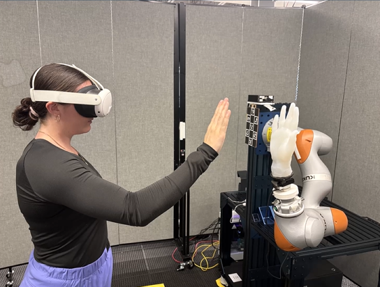
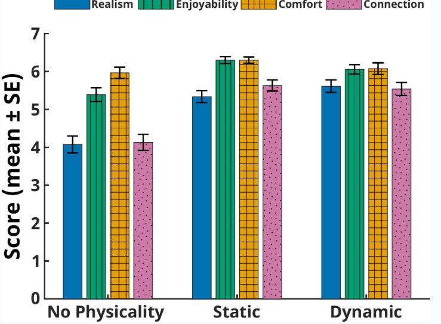

# Projects

## 2025

  

    
  

  

    <h3 class="publication-title">
      <a href="https://ericg5.github.io/ResearchPortfolio/papers/ETHOS/"
         target="_blank"
         rel="noopener noreferrer">
        ETHOS: A Robotic Encountered-Type Haptic Display for Social Interaction in Virtual Reality
      </a>
    </h3>

    

      Developed haptic feedback for Virtual Reality (VR) using a KUKA LWR iiwa and end-effector props. 
      My focus was on VR development and virtual-robot communication.
    

    
2025

    

      Human-Robot Interaction
      Virtual Reality
      <a href="https://arxiv.org/abs/2511.05379"
         class="tag tag-arxiv"
         target="_blank"
         rel="noopener noreferrer">
        ARXIV
      </a>
    

  

  

    
  

  

    <h3 class="publication-title">
      <a href="https://ericg5.github.io/ResearchPortfolio/papers/SocialPhysicalInteractions/"
         target="_blank"
         rel="noopener noreferrer">
        Social-Physical Interactions with Virtual Characters: Evaluating the Impact of Physicality through Encountered-Type Haptics
      </a>
    </h3>

    

      Evaluated the image of our VR haptic system on presence and immersion in VR. A user study with 55 participants was conducted with positive results.
    

    
2025

    

      User Study
      Human-Robot Interaction
      Virtual Reality
      <a href="https://arxiv.org/pdf/2511.05683"
         class="tag tag-arxiv"
         target="_blank"
         rel="noopener noreferrer">
        ARXIV
      </a>
    

  

